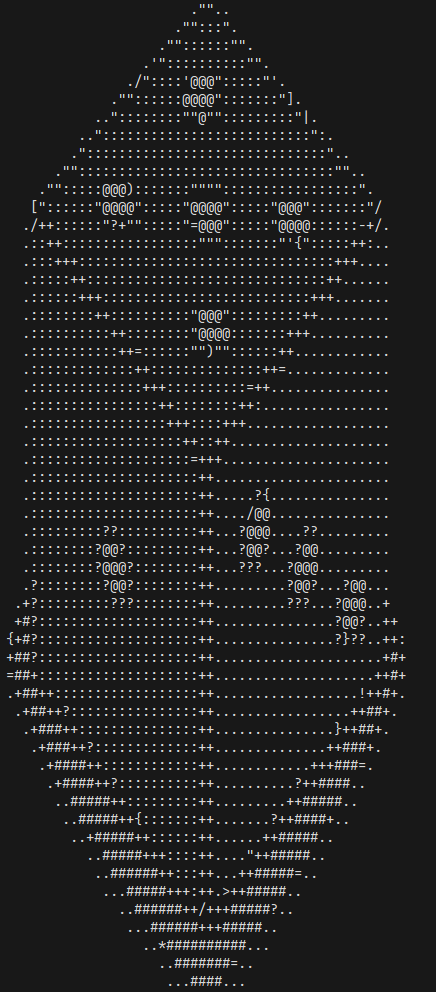

# What is this Project

A Converter From Image to Ascii Image

## Example

Image

Result

## Command to run

go run ./main.go -i path/to/file

## What is The Motivation of This Project

The plan is to learn Data Structure & Algorithm Based On Project. And how scaling image work. And doing something fun to be able to see image in terminal instead pixel this is character (The Wonder Of Math)

few image manipulation that i want learn that is
- Nearest Neighbor Interpolation [Done]
- Bilinear Interpolation [Done]
- Bicubic Interpolation
- Edge Detection [Done]
- Gaussian blur -> [Current] (many article says do gaussian blur before edge detection)

After Few Weeks Of Building This Little Side/Fun Project There are few thing i learn
the word above like nearest neighbor or other it sound scary but with little of time it's not that difficult to implement (maybe part of it golang already provide the std package like image, color, etc)

## Step By Step Journey
I Start From Something Simple Get The Image, convert to grayscale, Scale Down Using Simplest Algorithm and Render To Ascii Took Me 1 Week To Complete. I Get The Result, An Satisfied with the result

And than i continue to Other Scale Algorithm called Bilinear Algorithm took me 2 days to understand and i get the result the scale are much better than previous algo and render the result I Satisfied with the Result

And i try to continue again but instead new algo for Scaling, its adding edge detection, the idea for edge detection are from AI itself when i asked what can i improve in this project and it give me edge detection. it took 1 days but with the help of Computerphile video and some AI that assist me find the basic fundemantal for web (finding in article one by one it's hassle to do and since it's edge detection which well know knowledge it wont hallucinate, right....?) for this edge detection i get the result but its not done yet. in need to scale down the edge detection image, but why i do that instead. Why i dont scale down than edge detection will it quite simple scaling mean information, so when down scaling mean remove some information for edge detection you need to complete information if not the result will not what you expect it possible but the detection you got will be lossy or a mess.

Which is why edege detecion first and than down scale, but to down scale edge detection image are little bit different i try to use usually scale like bilinear interpolation the result are messed. So i try to asked AI downscale for edge detection it's called Maxpooling. it took almost few (i forget how many days) days just for this to complete and i get the result. I Satisfied with the result

Next how to combine both scale down image and scale down edge image. Previously we just need scale down image to render to ascii, now we need both scaled down image and scale down edge image. first i need to know to tell the program this pixel have a strong edge color so we render this way if its not we render different way. So what we need are threshold that if lets says if the edge color above equal 150 (number can anything or use some wakey way to get number dynamimcally) and less than 255 (max gray color) if its more than than 150 it's an edge, else not an edge.

I Still Planning to improve this project because after a little research there still many way to process image and right now i have minim test(too lazy to add). Maybe i should add test, the test probably making sure the math correct, there will be no border problem. Because to tell the truth too many test make me more lazy to develop it became a burden instead of helpful

### Algo
Step By Step Algo:

1. Get Image
2. Convert To GrayScale
3. Get Edge Detection image
4. Downscale The GrayScale Image
5. Downscale The Edge Detection Image
6. Render Image To Ascii

### Terms
New Terms for all search that i through:
- kernel convolution
- filter
- MaxPooling
- Nearest Neighbor
- Bilinear Interpolation
- Linear Interpolation
- Bicubic Interpolation
- Dithering
- Gaussian blur
- Edge Detection (Sobel Operator)
- CNN (Convolution Neural Network)

### Rant
for the Maxpooling part, that part ugh... its painful. soo many edge case to the point that i don't care anymore about the edge case, if the result are good, than it's good

Here some tips for you: to start a side project start from small and improve it little by little without realizing you already create some many thing

What do i learn from this all fun but painful:

Image Processing it's Hard especially debugging this. And you know the boundary, making sure they using a correct pixel if not BOOM... failed. especially the image 1000 x 1000 ohh boy good luck finding incorrect pixel in 1.000.000 pixel. And sometimes you don't know if the result are correct because it's produce the result but your is math is ways off. i have to use AI to make sure the math is correct because seeing soo many "+-/*" 

Well from all this rant i did quite enjoy this project, learn soo many thing, even forget what time is it. Usually when i code i just code for 1 - 2 hour, but since the project i build is intresting and fun without realizing it already 5+ hours.

